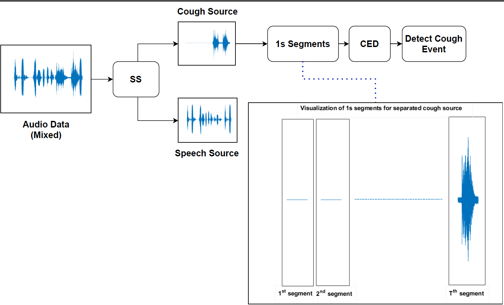

# SS+CEDNet: A Speech Privacy Aware Cough Detection Pipeline by Separating Sources
Official repository for SS+CEDNet, R-10 HTC 2022

## [Paper][SS+CEDNet] || [Video][video]

[SS+CEDNet]: https://naimulhassan.github.io/content/papers/SS+CEDNet.pdf
[video]: https://youtu.be/mTZv3QJ4b4A

          
          
</td>

Abstract: <i>Cough is one of the most distinguishable symptoms for Influenza-like-illness (ILI) and Severe Acute Respiratory Infection (SARI). Considering the recent worldwide COVID-19 pandemic, many types of research are ongoing all around the world for the accurate detection of cough events. But background speech events make it difficult for the algorithms to detect cough events and the performance of the models drops significantly. At the same time, speech privacy is not preserved in the traditional cough detection models. In this paper, we are proposing a pipeline, named SS+CEDNet, to overcome these problems. The pipeline consists of a Source Separation (SS) and a Cough Event Detection (CED) model. The SS model at first separates the cough and speech sources. Finally, the separated cough source is passed through the CED model to detect cough events. The pipeline not only preserves speech privacy by separating the sources but also shows a better cough detection accuracy.</i>

## Citation
@INPROCEEDINGS{9929794, 
  author={Hassan, K. M. Naimul and Haque, Mohammad Ariful}, 
  booktitle={2022 IEEE 10th Region 10 Humanitarian Technology Conference (R10-HTC)}, 
  title={SS+CEDNet: A Speech Privacy Aware Cough Detection Pipeline by Separating Sources},  
  year={2022}, 
  volume={}, 
  number={}, 
  pages={32-37}, 
  doi={10.1109/R10-HTC54060.2022.9929794}}